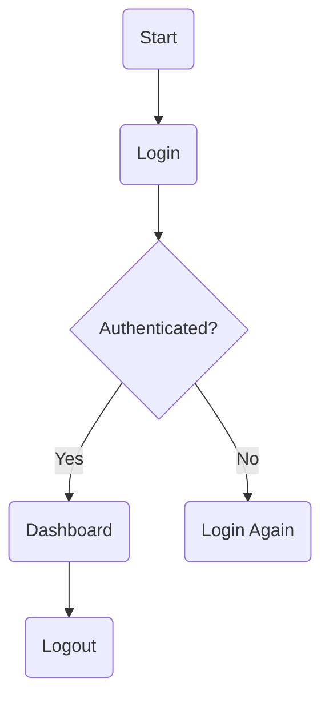
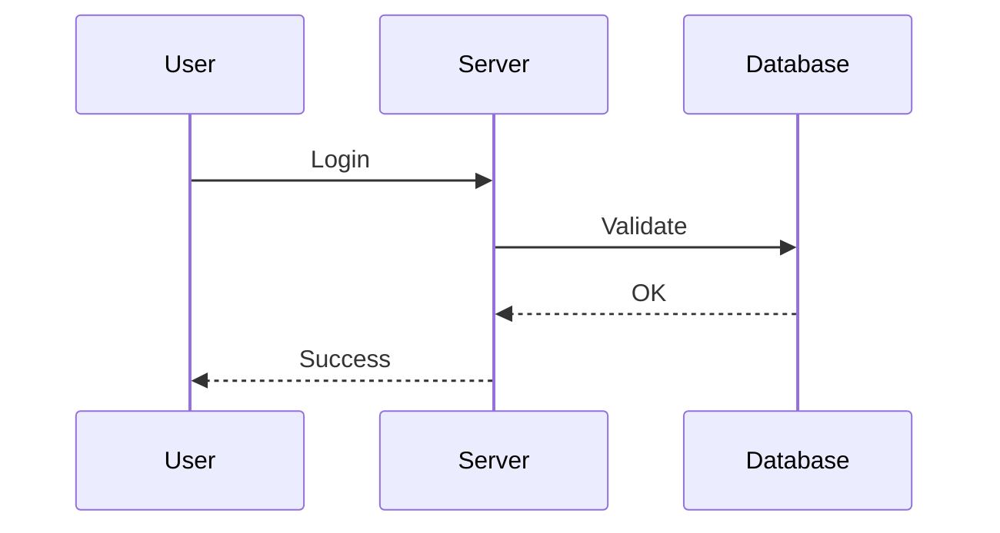
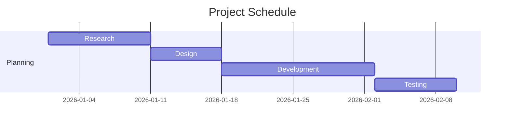
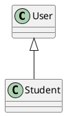

# AI DOCUMENT RENDERING ENGINE TEST DOCUMENT

---

# Heading 1

This is a normal paragraph demonstrating **bold**, *italic*, ***bold italic***, ~~strikethrough~~, `inline code`, highlighted text, superscript (x²), subscript (H₂O), hyperlinks, and footnotes.

> This is a block quote.
>
> The rendering engine should convert this into a professional Word callout box.

---

# Heading 2

## Heading 3

### Heading 4

#### Heading 5

##### Heading 6

---

# Bulleted Lists

* Item 1
* Item 2

  * Nested Item

    * Third Level

      * Fourth Level

---

# Numbered Lists

1. First
2. Second
3. Third

   1. Nested
   2. Nested

      1. Deep Nested

---

# Checklist

* [x] Requirement Completed

* [ ] Pending Review

* [x] Export Working

* [ ] Need Optimization

---

# Table

| Name  | Department | Salary   | Experience |
| ----- | ---------- | -------- | ---------- |
| John  | AI         | $95,000  | 6 Years    |
| Sarah | Design     | $82,000  | 4 Years    |
| Alex  | Backend    | $110,000 | 8 Years    |

Expected Output

✓ Native editable Word Table

✓ Alternating row colors

✓ Auto fit

✓ Styled Header

---

# Complex Table

| Quarter | Sales | Profit | Growth |
| ------- | ----- | ------ | ------ |
| Q1      | 25000 | 8200   | 12%    |
| Q2      | 32000 | 10200  | 18%    |
| Q3      | 39000 | 14000  | 21%    |
| Q4      | 45000 | 18100  | 25%    |

---

# Mathematical Equations

Inline

E = mc²

Display

[
\int_{0}^{\infty} e^{-x} dx = 1
]

Another

[
a^2+b^2=c^2
]

Matrix

[
\begin{bmatrix}
1 & 2\
3 & 4
\end{bmatrix}
]

---

# Python Code

```python
import numpy as np

def train(model):
    accuracy = 0.98

    if accuracy > 0.95:
        print("Excellent Model")

    return accuracy
```

Expected

✓ VS Code Theme

✓ Syntax Highlighting

✓ Line Numbers

✓ Rounded Container

---

# JavaScript

```javascript
const users = [];

function addUser(name){
    users.push(name);
}

console.log(users);
```

---

# JSON

```json
{
    "name":"ScholarX",
    "version":"2.0",
    "language":"TypeScript"
}
```

---

# SQL

```sql
SELECT *
FROM Students
WHERE GPA > 3.50
ORDER BY GPA DESC;
```

---

# Bash

```bash
npm install
npm run build
npm start
```

---

# Flowchart (ASCII)

```text
Start
   │
   ▼
Input Data
   │
   ▼
Process Data
   │
   ▼
Decision?
 ┌──┴───┐
 │      │
Yes     No
 │      │
 ▼      ▼
Save  Retry
 │      │
 └──┬───┘
    ▼
   End
```

Expected

✓ Editable Word Shapes

---

# Mermaid Flowchart



---

# Mermaid Sequence Diagram



---

# Mermaid Gantt Chart



---

# UML



---

# Organization Chart

CEO

├── CTO

│   ├── Backend Team

│   └── Frontend Team

├── CFO

└── COO

Expected

SmartArt

---

# Mind Map

Programming

├── Frontend

│   ├── React

│   ├── Vue

│   └── Angular

├── Backend

│   ├── Node

│   ├── Django

│   └── Laravel

---

# Decision Tree

Purchase?

├── Yes

│   ├── Payment Success

│   │      └── Download

│   └── Payment Failed

└── No

```
  └── Exit
```

---

# Timeline

2022

Started University

↓

2023

Learned React

↓

2024

Built Portfolio

↓

2025

Internship

↓

2026

Launched Startup

---

# Pie Chart Data

| Category | Value |
| -------- | ----- |
| AI       | 40    |
| Web      | 25    |
| Mobile   | 20    |
| Cloud    | 15    |

Expected

Editable Pie Chart

---

# Bar Chart

| Month | Revenue |
| ----- | ------- |
| Jan   | 12000   |
| Feb   | 16000   |
| Mar   | 21000   |
| Apr   | 30000   |

Expected

Editable Bar Chart

---

# Line Chart

| Year | Users |
| ---- | ----- |
| 2021 | 1200  |
| 2022 | 5000  |
| 2023 | 11000 |
| 2024 | 25000 |

---

# Scatter Plot

| Height | Weight |
| ------ | ------ |
| 160    | 58     |
| 168    | 65     |
| 172    | 71     |
| 180    | 80     |

---

# Image


Expected

✓ Download Image

✓ Embed

✓ Caption

✓ Resize

---

# Hyperlinks

OpenAI

[https://openai.com](https://openai.com)

Google

[https://google.com](https://google.com)

GitHub

[https://github.com](https://github.com)

---

# Warning Box

⚠ Warning

Always backup your data before deployment.

---

# Success Box

✅ Deployment Successful

---

# Information Box

ℹ System Update Available

---

# Note

**Note:**

This project requires Office Open XML rendering.

---

# Callout

💡 Tip

Use semantic parsing instead of Markdown parsing.

---

# References

[1] ISO/IEC 29500 Office Open XML

[2] Microsoft Word Developer Documentation

[3] ECMA-376 Standard

---

# Footnotes

Machine Learning is transforming document automation.[^1]

[^1]: This is an example footnote.

---

# Page Break

---

(New Page)

---

# Table of Contents

Expected

Automatic TOC

---

# Header

AI Document Rendering Engine

---

# Footer

Page Number

Document Version

Current Date

---

# Multi-column Layout

Column 1

Lorem ipsum...

Column 2

Lorem ipsum...

---

# End of Document
